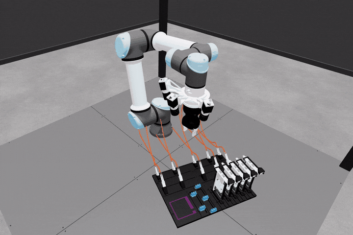

# AIC Newton

[](https://www.python.org/)
[](https://github.com/newton-physics/newton)
[](https://docs.astral.sh/uv/)
[](LICENSE)

A standalone [Newton](https://github.com/newton-physics/newton) simulation of the AI for Industry Challenge workcell. The [AI for Industry Challenge](https://www.intrinsic.ai/events/ai-for-industry-challenge) is an open competition for developers and roboticists working on high-impact robotics and manufacturing problems; its task centers on robotic cable manipulation and insertion. For the complete workflow, rules, interfaces, scene description, and submission guidance, see the [Intrinsic AIC repository](https://github.com/intrinsic-dev/aic).

The default scene represents a deterministic AIC Phase 1 setup. Five complete SFP-to-SC cable assemblies start docked on the task board alongside five NIC cards and five SC ports. The selected cable is simulated dynamically and can be manipulated manually or with the automatic extraction and insertion task.

<div align="center">
  
</div>

## Requirements

- **Python** 3.10+
- **OS:** Linux (x86-64, aarch64), Windows (x86-64), or macOS (CPU only)
- **GPU:** NVIDIA GPU (Maxwell or newer), driver 545 or newer (CUDA 12). No local CUDA Toolkit installation required. macOS runs on CPU.

For detailed system requirements, see the [installation guide](https://newton-physics.github.io/newton/latest/guide/installation.html). For tested configurations and Newton's versioning and deprecation policies, see the [compatibility guide](https://newton-physics.github.io/newton/latest/guide/compatibility.html).

## Quickstart

Create the locked environment and install all dependencies:

```bash
uv sync
```

Run the automatic extraction and insertion sequence with sensor-camera views:

```bash
uv run aic --auto --camera
```

Launch the interactive OpenGL viewer in keyboard-controlled TCP mode:

```bash
uv run aic
```

### Options

| Argument | Default | Description |
| --- | --- | --- |
| `--auto` | off | Run the automatic cable extraction and insertion sequence |
| `--camera` | off | Open the three sensor-camera images |
| `--cable-index INDEX` | `0` | Select the zero-based cable assembly |
| `--nic-card-index INDEX` | `0` | Select the zero-based destination NIC card |
| `--nic-port-index INDEX` | `0` | Select the zero-based SFP port on the destination NIC card |

### Keyboard Controls

Click the viewer before using the controls. Translation commands operate in the
world frame; rotation commands operate in the local TCP frame.

| Keys | Action |
| --- | --- |
| `I` / `K` | Move the TCP along positive / negative world X |
| `J` / `L` | Move the TCP along positive / negative world Y |
| `U` / `O` | Move the TCP along positive / negative world Z |
| `Shift` + movement key | Rotate about the corresponding local TCP axis |
| `R` | Reset the complete scene and restart automatic mode when enabled |

## Configuration

Editable typed defaults live in `src/aic_newton/config/`:

| File | Parameters |
| --- | --- |
| `camera.py` | Sensor resolution, update rate, optics, and image-panel layout |
| `cable.py` | Cable geometry, material, contacts, constraints, and discretization |
| `control.py` | Robot gains and home pose, manual TCP speeds, grasp offsets, tolerances, and automatic motion profiles |
| `scene.py` | Task-board layout and connector fixture poses |
| `task.py` | Zero-based cable, NIC card, and NIC port target indices |
| `simulation.py` | Frame timing, contact capacities, and MuJoCo/VBD coupling settings |
| `viewer.py` | Initial view, navigation speed, and scene lighting |

## License

The project code is licensed under the [Apache License 2.0](LICENSE). Content derived from the Intrinsic AIC project retains its upstream [Apache License 2.0](assets/aic_assets/LICENSE) terms and [source attribution](assets/aic_assets/SOURCE.md).
